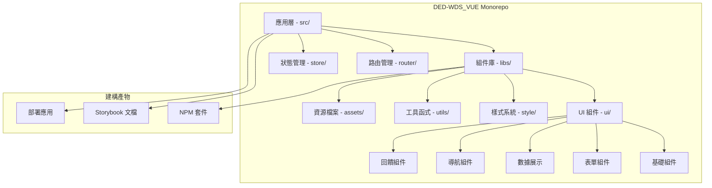

# DED-WDS_VUE

**Web Design System - Vue 3 組件庫**

[](https://opensource.org/licenses/MIT)
[](https://nx.dev)
[](https://vuejs.org/)
[](https://www.typescriptlang.org/)

---

## 📋 目錄

- [專案簡介](#專案簡介)
- [技術架構](#技術架構)
- [系統需求](#系統需求)
- [快速開始](#快速開始)
- [專案結構](#專案結構)
- [開發指南](#開發指南)
- [測試規範](#測試規範)
- [部署流程](#部署流程)
- [版本控管](#版本控管)
- [貢獻指南](#貢獻指南)
- [授權資訊](#授權資訊)

---

## 📖 專案簡介

DED-WDS_VUE 是一個基於 **Vue 3** 和 **TypeScript** 的現代化 Web 設計系統組件庫，採用 **Nx Monorepo** 架構管理。專案提供一套完整、可重用、高度客製化的 UI 組件，適用於企業級應用開發。

### ✨ 核心特色

- **🎨 完整組件庫**: 提供 50+ 個精心設計的 UI 組件
- **📱 響應式設計**: 支援桌面、平板、行動裝置完美適配
- **♿ 無障礙設計**: 符合 WCAG 2.1 AA 標準
- **🎯 TypeScript 支援**: 完整的型別定義和 IntelliSense
- **📚 Storybook 文檔**: 互動式組件文檔和範例展示
- **🧪 完整測試**: 單元測試覆蓋率 > 80%
- **🌐 國際化**: 支援繁體中文介面
- **🎭 主題客製**: 支援深色模式與自訂主題

### 🎯 適用場景

- 企業內部管理系統
- 數據視覺化儀表板
- 電商平台前端
- SaaS 產品介面
- 個人作品集網站

---

## 🏗️ 技術架構

### 核心技術棧

| 技術             | 版本   | 用途          |
| ---------------- | ------ | ------------- |
| **Vue**          | 3.3.4  | 前端框架      |
| **TypeScript**   | 5.5.2  | 類型系統      |
| **Vite**         | 5.0.0  | 建構工具      |
| **Nx**           | 19.5.3 | Monorepo 管理 |
| **Pinia**        | 3.0.4  | 狀態管理      |
| **Vue Router**   | 4.5.0  | 路由管理      |
| **Tailwind CSS** | 3.4.17 | 樣式框架      |
| **Storybook**    | 8.2.6  | 組件文檔      |
| **Vitest**       | 1.3.1  | 單元測試      |

### 其他依賴

- **圖表庫**: Highcharts, Chart.js
- **檔案上傳**: Uppy
- **動畫**: GSAP
- **程式碼高亮**: Highlight.js

### 系統架構圖



---

## 💻 系統需求

### 作業系統

- **支援平台**: macOS, Windows, Linux
- **開發環境**: Windows (PowerShell 7+)

### 軟體需求

```bash
Node.js  >= 18.0.0
npm      >= 9.0.0
git      >= 2.30.0
```

### 開發工具建議

- **IDE**: VS Code (推薦安裝 Volar、ESLint、Prettier 擴充)
- **瀏覽器**: Chrome / Edge / Firefox (最新版本)

---

## 🚀 快速開始

### 1️⃣ 專案克隆

```powershell
# 克隆專案
git clone https://github.com/uedteam/DED-WDS_VUE.git

# 進入專案目錄
cd DED-WDS_VUE
```

### 2️⃣ 安裝依賴

```powershell
# 安裝所有依賴
npm install
```

### 3️⃣ 啟動開發伺服器

```powershell
# 啟動主應用
npm start
# 或
npx nx serve DED-WDS

# 開發伺服器將運行於 http://localhost:4200
```

### 4️⃣ 啟動 Storybook

```powershell
# 啟動 Storybook 組件文檔
npm run storybook

# Storybook 將運行於 http://localhost:6006
```

### 5️⃣ 建構專案

```powershell
# 建構生產版本
npm run build

# 建構產物位於 dist/ 目錄
```

---

## 📁 專案結構

```
DED-WDS_VUE/
├── .github/                 # GitHub 工作流程設定
├── .storybook/              # Storybook 設定檔
├── dist/                    # 建構產物目錄
├── libs/                    # 組件庫核心
│   ├── src/
│   │   ├── ui/             # UI 組件 (50+ 個元件)
│   │   ├── style/          # 樣式系統 (SCSS/CSS)
│   │   ├── composable/     # Vue Composables
│   │   ├── utils/          # 工具函式
│   │   └── assets/         # 圖示、字型等資源
│   ├── package.json        # 組件庫套件設定
│   └── vite.config.ts      # Vite 建構設定
├── src/                     # 主應用程式
│   ├── app/                # 應用核心
│   ├── pages/              # 頁面組件
│   ├── router/             # 路由設定
│   ├── store/              # Pinia 狀態管理
│   ├── template/           # 頁面模板
│   ├── test/               # 測試檔案
│   ├── main.ts             # 應用入口
│   └── styles.scss         # 全域樣式
├── nx.json                  # Nx 工作區設定
├── package.json             # 根套件設定
├── tsconfig.json            # TypeScript 設定
├── tailwind.config.js       # Tailwind CSS 設定
├── vite.config.ts           # Vite 設定
└── README.md                # 專案說明文件 (本檔案)
```

### 核心目錄說明

| 目錄              | 說明                           |
| ----------------- | ------------------------------ |
| `libs/src/ui/`    | 所有 UI 組件的原始碼           |
| `libs/src/style/` | 樣式系統與主題定義             |
| `src/pages/`      | 應用頁面與示例                 |
| `src/template/`   | 可重用頁面模板（如 Portfolio） |
| `.storybook/`     | Storybook 組件文檔設定         |

---

## 🛠️ 開發指南

### 設計原則

本專案遵循 **SOLID 設計原則**：

- **單一職責原則 (SRP)**: 每個組件僅負責一項功能
- **開放封閉原則 (OCP)**: 組件開放擴展、封閉修改
- **依賴反轉原則 (DIP)**: 依賴抽象而非具體實現

### 程式碼規範

#### 1. 註解規範

```typescript
/**
 * 按鈕組件 - 提供多種樣式與尺寸的互動按鈕
 *
 * @param {String} variant - 按鈕樣式: 'primary' | 'secondary' | 'outline'
 * @param {String} size - 按鈕尺寸: 'sm' | 'md' | 'lg'
 * @param {Boolean} disabled - 是否禁用
 * @returns {VNode} Vue 組件節點
 */
export const Button = defineComponent({
  // 組件實作...
});
```

**註解要求**：

- ✅ **必須使用繁體中文**
- ✅ 函式必須包含用途說明
- ✅ 重要參數必須註解型別與用途
- ❌ 禁止「看得懂就好」的自我感覺式命名

#### 2. 命名規範

```typescript
// ✅ 良好命名
const handleSubmitForm = () => {
  /* ... */
};
const isUserAuthenticated = ref(false);
const userProfileData = reactive({});

// ❌ 不良命名
const handle = () => {
  /* ... */
};
const flag = ref(false);
const data = reactive({});
```

#### 3. 組件開發規範

```vue
<script setup lang="ts">
/**
 * 卡片組件 - 用於展示內容區塊
 */
import { computed } from 'vue';

// Props 定義
interface CardProps {
  /** 卡片標題 */
  title: string;
  /** 卡片內容 */
  content?: string;
  /** 是否顯示陰影 */
  shadow?: boolean;
}

const props = withDefaults(defineProps<CardProps>(), {
  shadow: true,
});

// 計算屬性
const cardClasses = computed(() => ({
  'shadow-lg': props.shadow,
  'shadow-none': !props.shadow,
}));
</script>

<template>
  <!-- 使用語意化 HTML -->
  <article :class="cardClasses">
    <header>
      <h2>{{ title }}</h2>
    </header>
    <section>
      <slot>{{ content }}</slot>
    </section>
  </article>
</template>
```

### 可用指令

```powershell
# 開發
npm start                    # 啟動開發伺服器
npm run storybook            # 啟動 Storybook

# 建構
npm run build                # 建構生產版本
npm run build-storybook      # 建構 Storybook 靜態檔案

# 測試
npm test                     # 執行單元測試
npx nx test libs             # 測試組件庫

# 部署
npm run deploy               # 部署應用至 GitHub Pages
npm run deploy-storybook     # 部署 Storybook 文檔

# 工具
npx nx graph                 # 顯示專案依賴圖
npm run reset                # 重置 Nx 快取
```

---

## 🧪 測試規範

### 單元測試要求

> ⚠️ **重要**: 每完成一個小任務 **必須完成單元測試**，測試未通過不得進行下一項任務。

### 測試框架

- **測試工具**: Vitest
- **測試工具庫**: @vue/test-utils
- **斷言庫**: Vitest (內建)

### 測試範例

```typescript
/**
 * Button 組件單元測試
 */
import { describe, it, expect } from 'vitest';
import { mount } from '@vue/test-utils';
import Button from './Button.vue';

describe('Button 組件', () => {
  it('應該正確渲染按鈕文字', () => {
    const wrapper = mount(Button, {
      slots: {
        default: '點擊我',
      },
    });
    expect(wrapper.text()).toBe('點擊我');
  });

  it('當 disabled 為 true 時應該禁用按鈕', () => {
    const wrapper = mount(Button, {
      props: {
        disabled: true,
      },
    });
    expect(wrapper.attributes('disabled')).toBeDefined();
  });

  it('點擊時應該觸發 click 事件', async () => {
    const wrapper = mount(Button);
    await wrapper.trigger('click');
    expect(wrapper.emitted()).toHaveProperty('click');
  });
});
```

### 執行測試

```powershell
# 執行所有測試
npm test

# 監聽模式（開發時使用）
npx nx test libs --watch

# 生成測試覆蓋率報告
npx nx test libs --coverage
```

### E2E 測試

> 📝 專案完成後，若有前端介面，必須使用瀏覽器工具進行 End-to-End 測試。

```powershell
# 使用 Storybook Test Runner 進行 E2E 測試
npm run test-storybook
```

---

## 🚢 部署流程

### GitHub Pages 部署

```powershell
# 1. 建構專案
npm run build

# 2. 部署至 GitHub Pages
npm run deploy

# 應用將部署至: https://uedteam.github.io/DED-WDS_VUE
```

### Storybook 文檔部署

```powershell
# 1. 建構 Storybook
npm run build-storybook

# 2. 部署 Storybook
npm run deploy-storybook

# 文檔將部署至 GitHub Pages
```

### NPM 套件發布

```powershell
# 1. 更新版本號（遵循 Semantic Versioning）
npm version patch  # 修補版本 (1.0.0 -> 1.0.1)
npm version minor  # 次版本 (1.0.0 -> 1.1.0)
npm version major  # 主版本 (1.0.0 -> 2.0.0)

# 2. 建構組件庫
npm run build

# 3. 發布至 NPM (需先登入)
npm publish
```

---

## 🔀 版本控管

### Git 分支策略

```
main (主分支)
  ├── develop (開發分支)
  │   ├── feature/button-component (功能分支)
  │   ├── feature/form-validation (功能分支)
  │   └── bugfix/header-style (修復分支)
  └── hotfix/security-patch (熱修復分支)
```

### 分支命名規範

- **功能分支**: `feature/功能名稱`
- **修復分支**: `bugfix/問題描述`
- **熱修復**: `hotfix/緊急修復描述`

### Commit 訊息規範

遵循 **Conventional Commits** 格式：

```bash
# 格式
<類型>(<範圍>): <簡短描述>

<詳細說明>

# 範例
feat(Button): 新增 loading 狀態支援

- 新增 loading prop
- 新增載入動畫
- 更新單元測試

# 類型說明
feat:     新功能
fix:      錯誤修復
docs:     文檔更新
style:    程式碼格式調整
refactor: 重構
test:     測試相關
chore:    建構工具或輔助工具變動
```

### Commit 規則

✅ **必須遵守**：

- 每完成一項任務必須 commit
- Commit 訊息必須清楚描述變更內容
- 一次 commit 只包含相關變更

❌ **禁止行為**：

- 「一次改一堆再一起丟」
- 無意義的 commit 訊息（如 "update", "fix"）
- 包含多個不相關功能的 commit

---

## 👥 貢獻指南

### 開發流程

1. **Fork 專案** 並克隆到本地
2. **建立功能分支**: `git checkout -b feature/amazing-feature`
3. **完成開發並撰寫測試**
4. **確保測試通過**: `npm test`
5. **提交變更**: `git commit -m 'feat: 新增絕妙功能'`
6. **推送分支**: `git push origin feature/amazing-feature`
7. **建立 Pull Request**

### Pull Request 規範

- PR 標題應清楚描述變更內容
- 提供詳細的變更說明與測試結果
- 確保 CI/CD 檢查全部通過
- 至少需要一位 Reviewer 核准

### Code Review 檢查清單

- [ ] 程式碼遵循專案規範
- [ ] 包含完整的中文註解
- [ ] 單元測試覆蓋率充足
- [ ] 無 ESLint 錯誤或警告
- [ ] 文檔已同步更新

---

## 📚 相關文檔

- **[Storybook 組件文檔](https://uedteam.github.io/DED-WDS_VUE)**
- **[專案規格說明](./spec.md)** - 系統設計與開發規範（請先建立）
- **[Portfolio 模板說明](./PORTFOLIO_TEMPLATE.md)** - 作品集模板使用指南
- **[更新日誌](./libs/src/ChangeLog.md)** - 版本更新記錄

### 技術文檔

- [Nx 文檔](https://nx.dev)
- [Vue 3 文檔](https://vuejs.org)
- [Vite 文檔](https://vitejs.dev)
- [Tailwind CSS 文檔](https://tailwindcss.com)

---

## 🐛 問題回報

如遇到問題，請透過以下方式回報：

1. **GitHub Issues**: [建立 Issue](https://github.com/uedteam/DED-WDS_VUE/issues)
2. **提供資訊**:
   - 問題描述
   - 重現步驟
   - 預期行為
   - 實際行為
   - 環境資訊（OS、Node 版本等）

---

## 📄 授權資訊

本專案採用 **MIT License** 授權。

```
MIT License

Copyright (c) 2024 UED Team

Permission is hereby granted, free of charge, to any person obtaining a copy
of this software and associated documentation files (the "Software"), to deal
in the Software without restriction...
```

詳見 [LICENSE](./LICENSE) 檔案。

---

## 👨‍💻 專案維護者

- **Kevin Yang** - 專案負責人 - [kevin.kk.yang@auo.com](mailto:kevin.kk.yang@auo.com)
- **Amos Lee** - 核心貢獻者 - [amos.lee@auo.com](mailto:amos.lee@auo.com)

---

## 🙏 致謝

感謝所有為本專案做出貢獻的開發者！

---

## 📞 聯絡資訊

- **專案首頁**: [https://uedteam.github.io/DED-WDS_VUE](https://uedteam.github.io/DED-WDS_VUE)
- **GitHub Repository**: [https://github.com/uedteam/DED-WDS_VUE](https://github.com/uedteam/DED-WDS_VUE)
- **問題回報**: [GitHub Issues](https://github.com/uedteam/DED-WDS_VUE/issues)

---

**最後更新**: 2026-02-09  
**版本**: v1.0.0  
**語言**: 繁體中文  
**技術棧**: Vue 3 + TypeScript + Nx + Vite + Tailwind CSS
